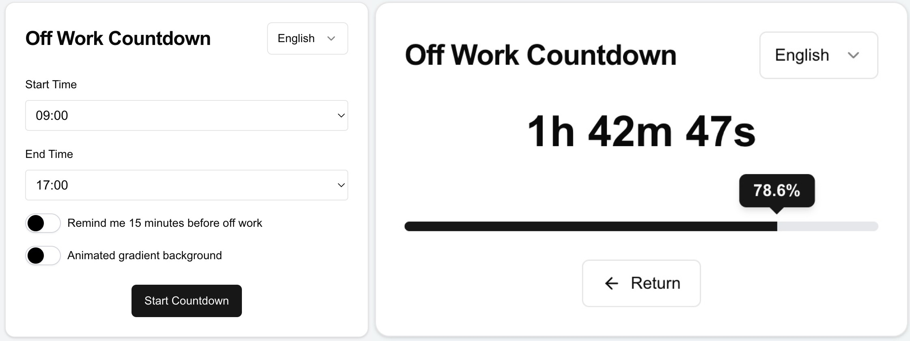

# Off Work Countdown

Off Work Countdown is a Next.js-based web application that helps you keep track of the time remaining until the end of your workday. With a sleek and interactive interface, this app provides a visual countdown and progress bar to make your workday more manageable.

[中文版 README](README_CN.md)



## Features

- Set custom work start and end times
- Real-time countdown display
- Visual progress bar
- Optional 15-minute reminder before the end of work
- Animated gradient background option
- Progressive Web App (PWA) support for offline use
- Responsive design for various devices
- Multi-language support (i18n)
- Dark mode support (light/dark/auto)

## Technologies Used

- Next.js 15 (App Router)
- React
- TypeScript
- Tailwind CSS
- Framer Motion
- next-pwa
- i18next

## Getting Started

1. Clone the repository:
```bash
git clone https://github.com/ififi2017/Off-Work-Countdown.git
```

2. Install dependencies:
```bash
cd Off-Work-Countdown
npm install
```

3. Configure environment variables:
Create a `.env.local` file in the root directory:
```env
NEXT_PUBLIC_BASE_URL=http://localhost:3000
```

4. Run the development server:
```bash
npm run dev
```

5. Open [http://localhost:3000](http://localhost:3000) with your browser to see the result.

## Configuration

### Site Configuration

The site configuration is centralized in `config/site.ts`:

```typescript
export const siteConfig = {
  name: "Off Work Countdown",
  baseUrl: process.env.NEXT_PUBLIC_BASE_URL || 'https://off.rainif.com',
  github: "https://github.com/ififi2017/Off-Work-Countdown",
  themeColor: "#F3F4F6",
} as const;
```

### i18n Configuration

Language configuration is managed in `i18n-config.ts`:

```typescript
export const defaultLocale = 'en'
export const locales = ['en', 'zh-CN', 'zh-TW', ...] as const;

// Language mapping for variants
export const languageMapping = {
  'zh': 'zh-CN',
  'zh-Hans': 'zh-CN',
  // ... more mappings
};

// Language display names
export const languageNames = {
  'en': 'English',
  'zh-CN': '简体中文',
  // ... more names
};
```

## Usage

1. Set your work start and end times using the dropdown menus.
2. Toggle the reminder switch if you want a notification 15 minutes before the end of work.
3. Enable the animated gradient background if desired.
4. Click "Start Countdown" to begin tracking your workday.
5. The app will display the remaining time and a progress bar.
6. You can return to the settings at any time by clicking the "Return" button.
7. Use the language selector to switch between available languages.
8. Toggle between light, dark, and auto theme modes using the theme switcher.

## PWA Support

This app supports Progressive Web App features, allowing you to install it on your device and use it offline. To install:

1. Open the app in a supported browser (e.g., Chrome, Edge).
2. Look for the install prompt in the address bar or menu.
3. Follow the prompts to install the app on your device.

## Contributing

Contributions are welcome! Please feel free to submit a Pull Request.

### Adding Language Support

We're looking to expand our app's language support. If you'd like to contribute translations:

1. Fork the repository and create a new branch for your language.
2. Add your language code to the `locales` array in `i18n-config.ts`.
3. Add your language name to the `languageNames` object in `i18n-config.ts`.
4. Create translation files in the `public/locales/[lang]` directory:
   - `translation.json` - for UI strings
   - `seo.json` - for SEO metadata
5. Test the app thoroughly with the new language.
6. Submit a pull request with your changes.

## License

This project is open source and available under the [MIT License](LICENSE).

## Acknowledgements

Special thanks to:
- [@v0.dev](https://v0.dev/) for AI assistance in component design
- [@cursor.com](https://www.cursor.com/) for AI-powered coding assistance
- [@claude.ai](https://claude.ai/chats) and [@chatgpt.com](https://chatgpt.com/) for large language model support in development
- [@vercel.com](https://vercel.com/) for providing hosting and deployment services