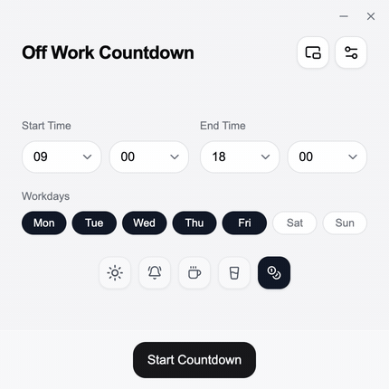
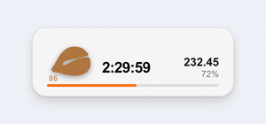

# Off Work Countdown

Off Work Countdown is a privacy-friendly countdown for the end of your workday,
available on the Web and as a lightweight Tauri desktop app. Set your schedule
once, then keep the remaining time, progress and estimated earnings at a glance.

[中文版 README](README_CN.md)

[](https://off.rainif.com/en)
[](https://github.com/ififi2017/Off-Work-Countdown/releases/latest)
[](LICENSE)

<p align="center">
  <picture>
    <source media="(prefers-color-scheme: dark)" srcset="readme_image/demo/app-en-dark.gif">
    <source media="(prefers-color-scheme: light)" srcset="readme_image/demo/app-en-light.gif">
    
  </picture>
  <picture>
    <source media="(prefers-color-scheme: dark)" srcset="readme_image/demo/mini-en-dark.gif">
    <source media="(prefers-color-scheme: light)" srcset="readme_image/demo/mini-en-light.gif">
    
  </picture>
</p>

## Use Off Work Countdown

- **Web:** [open the app](https://off.rainif.com/en) — no installation required.
- **Desktop:** [open the download page](https://off.rainif.com/en/download) —
  macOS Apple Silicon / Intel and Windows x64 / ARM64 are available. The macOS
  build requires macOS 11.3 (Big Sur) or later.
- **Windows, from the Microsoft Store:**
  [get it from the Store](https://apps.microsoft.com/detail/9PM0HJ2PP2LJ) — it
  updates itself and installs without the SmartScreen prompt.
- **macOS, from the Mac App Store:**
  [get it from the App Store](https://apps.apple.com/us/app/off-work-countdown/id6802803318)
  — **US$0.99**, and the only paid build. It installs in one click, updates
  through the App Store, and adds a countdown widget the free build does not
  have. Buying it is a way to support the project rather than a requirement:
  the DMGs above are built from this same repository, stay free, and are not
  going away.
- **Release files:** [latest GitHub Release](https://github.com/ififi2017/Off-Work-Countdown/releases/latest).

The desktop app adds a menu-bar countdown on macOS, a compact always-on-top
mini timer on Windows, native notifications, launch at login, a global shortcut
and one-click updates. It remains local-first: schedules, salary settings and
countdown state stay on your device.

On launch the app asks GitHub whether a newer version exists. That request
carries no account, salary or usage data, and the installer is downloaded only
after you choose to update. If GitHub cannot be reached directly — common on
some networks — the update panel offers a one-click retry through a public
mirror (`gh-proxy.com`). The mirror only changes where the bytes come from:
every updater package is verified against the signing key built into the app
before it is installed, so a tampered download is rejected either way. To point
at a different mirror or drop it entirely, change `MIRROR_UPDATER_ENDPOINT` in
`src-tauri/src/lib.rs`, `UPDATE_MIRROR_HOST` in `lib/desktop-state.ts` and
`MIRROR_PREFIX` in `scripts/mirror-manifest.mjs`.

### Install the desktop app

The current builds are open source but are **not signed with paid Apple or
Microsoft code-signing certificates**. The updater packages are cryptographically
signed for Tauri's update verification, but macOS Gatekeeper or Windows
SmartScreen may still warn on first installation. Download only from this
repository's Release page and verify that the tag and filename match your
platform.

The two store builds are the exception: Microsoft and Apple sign them during
certification, so they install without any warning and update through the store
rather than through the in-app updater.

#### macOS

The [Mac App Store build](https://apps.apple.com/us/app/off-work-countdown/id6802803318)
skips all of this: Apple signs it, so it installs in one click with no
Gatekeeper detour, and it carries a countdown widget. It needs **macOS 13
(Ventura) or later** and costs US$0.99 — on macOS 14 (Sonoma) or later the
widget can sit on the desktop, on macOS 13 it lives in Notification Center.
The steps below are for the free DMGs, which stay available either way.

The DMGs require **macOS 11.3 (Big Sur) or later**, on Apple Silicon or Intel.

1. Download the `aarch64.dmg` for Apple Silicon or `x64.dmg` for an Intel Mac.
2. Open the DMG and drag Off Work Countdown into Applications.
3. Try to open it once. If macOS blocks the app, open **System Settings →
   Privacy & Security**, scroll to Security, choose **Open Anyway**, then confirm
   **Open**. Apple documents this process in
   [Open apps safely on your Mac](https://support.apple.com/102445).

#### Windows

The [Microsoft Store build](https://apps.microsoft.com/detail/9PM0HJ2PP2LJ) is
the smoothest route — no SmartScreen prompt, and the Store keeps it updated. The
steps below are for the direct installers.

1. Download `x64-setup.exe` for most PCs, or `arm64-setup.exe` for a Windows on
   ARM device. The MSI files are also available for managed installation.
2. Run the installer. If Microsoft Defender SmartScreen warns about the
   unrecognised app, review the publisher/source, then choose **More info → Run
   anyway** if that option is available and you trust the downloaded file.
3. Windows may apply stricter organisation or Smart App Control policies that do
   not offer an override. See Microsoft's
   [App & browser control documentation](https://support.microsoft.com/windows/security/windows-security/app-browser-control-in-the-windows-security-app)
   for the system controls involved.

## Features

- Set custom work start and end times, including overnight shifts that cross midnight
- Real-time countdown display and visual progress bar
- Choose which days of the week you work; the app knows when today is a rest day
- Live earnings for the day, derived from a monthly or daily salary
- Weekly and yearly totals estimated from your schedule
- Optional reminder 15 minutes before the end of work
- Share your countdown as a mood-based image, or as a link that opens on the same shift
- Native desktop notifications, launch at login and a global show/hide shortcut
- macOS menu-bar countdown and native glass mini timer; Windows compact mini timer
- In-app desktop updates from signed GitHub Release artifacts, with a mirror fallback when GitHub is unreachable
- Schedule reference pages: 996, 9 to 5, 9 to 6 and night shift
- Progressive Web App (PWA) support for offline use
- Light, dark, system and two custom themes
- Responsive design for various devices
- 19 languages (i18n)

Your hours and salary are stored only in your browser or desktop app. They are
never sent to a server, and nothing is synchronised between devices. Optional
Web analytics record only allowlisted aggregate event counts—no salary, schedule,
cookies, IP addresses or device identifiers.

## Technologies Used

- Next.js 15 (App Router)
- React 19
- TypeScript
- Tailwind CSS
- Framer Motion
- Serwist (service worker / PWA)
- i18next
- Tauri 2 and Rust
- AppKit for the native macOS mini timer

## Getting Started

1. Clone the repository:
```bash
git clone https://github.com/ififi2017/Off-Work-Countdown.git
```

2. Install dependencies:
```bash
cd Off-Work-Countdown
npm install
```

3. Configure the environment:
```bash
echo "NEXT_PUBLIC_BASE_URL=http://localhost:3000" > .env.local
```

4. Run the development server:
```bash
npm run dev
```

5. Open [http://localhost:3000](http://localhost:3000) with your browser to see the result.

Other useful scripts:

```bash
npm run lint           # ESLint
npm test               # Vitest unit tests
npm run build          # Production build (web)
npm run build:desktop  # Static export for the desktop app, output in out/
```

Release automation for maintainers:

```bash
npm run deploy:web                         # Validate and push committed main
npm run deploy:web -- --dry-run            # Validate without pushing
npm run release:desktop                    # Release package.json's version
npm run release:desktop -- 3.0.3           # Explicitly verify and release 3.0.3
npm run release:desktop -- --dry-run        # Run every release check, no tag
```

Both publishing commands require a clean `main` branch and fetch the remote
before acting. Desktop release additionally requires `HEAD` to equal
`origin/main`, rejects duplicate tags and asks you to type the exact tag before
it pushes. Pass `--yes` only in an intentionally non-interactive environment.

Note: `next dev` and `next build` share the `.next` directory. Running a build
while the dev server is up will leave the dev server serving chunks that no
longer exist. Stop the dev server first, or delete `.next` afterwards.

## Configuration

### Site Configuration

The site configuration is centralized in `config/site.ts`:

```typescript
export const siteConfig = {
  name: "Off Work Countdown",
  baseUrl: process.env.NEXT_PUBLIC_BASE_URL || 'https://off.rainif.com',
  github: "https://github.com/ififi2017/Off-Work-Countdown",
  themeColor: "#F3F4F6",
} as const;
```

### Analytics (optional)

Aggregate event counters for the share funnel. Entirely optional — with no
environment variables set, the endpoint accepts requests and does nothing, so
local development, CI and self-hosted deployments work without any setup.

No cookies, no identifiers, no IP or user-agent storage: the endpoint only
increments a daily counter per event name, and only for names on a fixed
allowlist (`lib/analytics-events.ts`).

| Variable | Purpose |
| --- | --- |
| `UPSTASH_REDIS_REST_URL` / `UPSTASH_REDIS_REST_TOKEN` | Upstash Redis REST credentials. `KV_REST_API_URL` / `KV_REST_API_TOKEN` are also accepted. |
| `ANALYTICS_STATS_TOKEN` | Enables the read-back route. Unset means `/api/e/stats` returns 404. |

On Vercel, add an Upstash Redis integration from the Marketplace and the
credentials are injected automatically. Read the counters with:

```bash
curl -H "Authorization: Bearer $ANALYTICS_STATS_TOKEN" https://your-domain/api/e/stats
```

The endpoint is public, so counts can be inflated by anyone willing to POST to
it. Treat the numbers as a directional signal, not a source of truth.

### i18n Configuration

Language configuration is managed in `i18n-config.ts`:

```typescript
export const defaultLocale = 'en'
export const locales = ['en', 'zh-CN', 'zh-TW', ...] as const

// Language code mapping
export const languageMapping = {
  'zh': 'zh-CN',
  'zh-Hans': 'zh-CN',
  // ... more mappings
}

// Language display names
export const languageNames = {
  'en': 'English',
  'zh-CN': '简体中文',
  // ... more names
}
```

### Content pages

The app interface is translated into all 19 languages, but the long-form pages
— the FAQ, "How it works" and the schedule reference pages — are deliberately
published in English and Simplified Chinese only (`lib/content-locales.ts`).
Prose of that length costs far more to translate and maintain than UI strings,
and spreading it across 19 locales would mostly produce copy nobody has
reviewed. Requests for those pages in other locales return 404 rather than
serving English under, say, a Japanese URL.

Chinese interfaces (including Traditional) link to the Chinese pages; every
other language links to the English ones.

## Usage

1. Set your work start and end times. If the end time is earlier than the start time, the shift is treated as crossing midnight.
2. Pick the days of the week you work. On a rest day the app says so, but you can still start a countdown.
3. Toggle the reminder switch if you want a notification 15 minutes before the end of work. The tab may sit in the background, but it has to stay open.
4. Optionally enter a monthly or daily salary to see the day's earnings accumulate.
5. Click "Start Countdown" to begin tracking your workday.
6. Use "Share" to send a friend an image or a link that opens on the same shift.
7. Return to the settings at any time with the "Return" button.
8. Use the language selector to switch between available languages.

## PWA Support

This app supports Progressive Web App features, allowing you to install it on your device and use it offline. To install:

1. Open the app in a supported browser (e.g., Chrome, Edge).
2. Look for the install prompt in the address bar or menu.
3. Follow the prompts to install the app on your device.

On iPhone and iPad, use the Share button in Safari and choose "Add to Home
Screen"; on macOS Safari, choose "Add to Dock".

The PWA is still supported, but desktop users who want a persistent menu-bar or
mini-timer experience, native reminders, launch at login and automatic updates
should use the [desktop app](https://off.rainif.com/en/download).

## Contributing

Contributions are welcome! Please feel free to submit a Pull Request.

`plans/005-product-3.0.md` records the current roadmap along with the reasoning behind
the decisions — including the things that were considered and deliberately not
built.

### Adding Language Support

We're looking to expand our app's language support. If you'd like to contribute translations:

1. Fork the repository and create a new branch for your language.
2. Add your language code to `locales` array in `i18n-config.ts`.
3. Add language mapping and display name if needed.
4. Create translation files in `public/locales/[lang]/`:
   - `translation.json` - for UI strings
   - `seo.json` - for SEO metadata
5. Test the app thoroughly with the new language.
6. Submit a pull request with your changes.

Those two files are all a new language needs. `content.json` and `presets.json`
exist only for English and Simplified Chinese by design — see "Content pages"
above.

## License

This project is open source and available under the [MIT License](LICENSE).

The bundled Geist fonts in `app/fonts/` are licensed separately under the
[SIL Open Font License 1.1](app/fonts/LICENSE.txt).

## Acknowledgements

Special thanks to:
- [@Google Gemini 3 Pro](https://gemini.google.com/) Powerful front-end AI generation capabilities
- [@v0.dev](https://v0.dev/) AI assistance in component design
- [@cursor.com](https://www.cursor.com/) AI-powered coding assistance
- [@Claude Code](https://claude.com/claude-code) Agentic coding for the SEO groundwork, sharing loop and retention features
- [@claude.ai](https://claude.ai/chats) and [@chatgpt.com](https://chatgpt.com/) Large language model support in development
- [@vercel.com](https://vercel.com/) Hosting and deployment services
- [@Cloudflare](https://www.cloudflare.com/) CDN services
