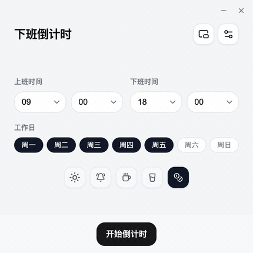
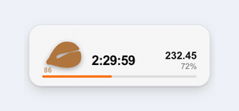

# 下班倒计时

下班倒计时是一款注重隐私的下班时间工具，同时提供网页版与轻量的 Tauri 桌面客户端。设置一次班次后，就能随时查看剩余时间、进度和预估收入。

[English README](README.md)

[](https://off.rainif.com/zh-CN)
[](https://github.com/ififi2017/Off-Work-Countdown/releases/latest)
[](LICENSE)

<p align="center">
  <picture>
    <source media="(prefers-color-scheme: dark)" srcset="readme_image/demo/app-zh-dark.gif">
    <source media="(prefers-color-scheme: light)" srcset="readme_image/demo/app-zh-light.gif">
    
  </picture>
  <picture>
    <source media="(prefers-color-scheme: dark)" srcset="readme_image/demo/mini-zh-dark.gif">
    <source media="(prefers-color-scheme: light)" srcset="readme_image/demo/mini-zh-light.gif">
    
  </picture>
</p>

## 使用下班倒计时

- **网页版：**[立即使用](https://off.rainif.com/zh-CN)，无需安装。
- **桌面客户端：**[打开下载页](https://off.rainif.com/zh-CN/download)，支持 macOS Apple Silicon / Intel 和 Windows x64 / ARM64。
- **Windows 用户：**[从 Microsoft Store 获取](https://apps.microsoft.com/detail/9PM0HJ2PP2LJ)，会自动更新，安装时也不会出现 SmartScreen 提示。
- **安装包列表：**[最新 GitHub Release](https://github.com/ififi2017/Off-Work-Countdown/releases/latest)。

桌面版额外提供 macOS 菜单栏倒计时、Windows 置顶迷你计时器、原生通知、登录时启动、全局快捷键和一键更新。它仍然坚持本地优先：班次、薪资设置与倒计时状态只保存在你的设备上。

### 安装桌面客户端

当前安装包完全开源，但**没有购买 Apple 或 Microsoft 的代码签名证书**。自动更新包带有 Tauri 用于校验更新来源的加密签名，但 macOS Gatekeeper 或 Windows SmartScreen 在首次安装时仍可能警告。请只从本仓库的 Release 页面下载，并核对 tag、平台和文件名。

Microsoft Store 版本是个例外：商店在认证阶段用自己的证书签名，因此安装时不会有任何警告，更新也由商店负责，不走应用内更新器。

#### macOS

1. Apple Silicon Mac 下载 `aarch64.dmg`，Intel Mac 下载 `x64.dmg`。
2. 打开 DMG，把“Off Work Countdown”拖入“应用程序”。
3. 先尝试打开一次。如果 macOS 阻止运行，请进入**系统设置 → 隐私与安全性**，滚动到“安全性”，点击**仍要打开**，然后再次确认**打开**。Apple 的官方说明见[安全地打开 Mac 上的 App](https://support.apple.com/zh-cn/102445)。

#### Windows

[Microsoft Store 版本](https://apps.microsoft.com/detail/9PM0HJ2PP2LJ)是最省事的一条：没有 SmartScreen 提示，更新也由商店负责。下面的步骤针对直接下载的安装包。

1. 大多数电脑下载 `x64-setup.exe`；Windows on ARM 设备下载 `arm64-setup.exe`。需要受管安装时也可选择对应 MSI。
2. 运行安装程序。如果 Microsoft Defender SmartScreen 提示无法识别应用，请先核对下载来源；确认信任后，在系统提供该选项时点击**更多信息 → 仍要运行**。
3. 公司管理策略或 Smart App Control 可能不提供绕过选项。相关系统设置见 Microsoft 的 [Windows 安全中心“应用和浏览器控制”说明](https://support.microsoft.com/zh-cn/windows/security/windows-security/app-browser-control-in-the-windows-security-app)。

## 功能特点

- 设置自定义上下班时间，支持跨过零点的夜班
- 实时倒计时显示与可视化进度条
- 选择一周中哪几天上班，非工作日会明确提示
- 按月薪或日薪实时累计今日收入
- 按当前设置推算本周与今年的累计天数、小时数与收入
- 可选的下班前 15 分钟提醒
- 把倒计时分享成心情图片，或分享成一条打开即是同一班次的链接
- 桌面端原生通知、登录时启动和全局显示/隐藏快捷键
- macOS 菜单栏倒计时与原生玻璃迷你窗；Windows 紧凑迷你计时器
- 通过带更新签名的 GitHub Release 在客户端内更新
- 常见作息说明页：996、朝九晚五、朝九晚六、夜班
- 支持离线使用的渐进式Web应用(PWA)
- 浅色、深色、跟随系统，以及两套自定义主题
- 适应各种设备的响应式设计
- 19 种语言(i18n)

上下班时间和薪资只存在你的浏览器或桌面客户端里，不会发送到服务器，也不会在设备之间同步。可选的 Web 统计只记录白名单内的聚合事件数，不记录薪资、班次、Cookie、IP 或设备标识。

## 使用的技术

- Next.js 15 (App Router)
- React 19
- TypeScript
- Tailwind CSS
- Framer Motion
- Serwist (Service Worker / PWA)
- i18next
- Tauri 2 与 Rust
- AppKit（macOS 原生迷你计时器）

## 开始使用

1. 克隆仓库:
```bash
git clone https://github.com/ififi2017/Off-Work-Countdown.git
```

2. 安装依赖:
```bash
cd Off-Work-Countdown
npm install
```

3. 配置环境:
```bash
echo "NEXT_PUBLIC_BASE_URL=http://localhost:3000" > .env.local
```

4. 运行开发服务器:
```bash
npm run dev
```

5. 在浏览器中打开 [http://localhost:3000](http://localhost:3000) 查看结果。

其他常用命令:

```bash
npm run lint           # ESLint
npm test               # Vitest 单元测试
npm run build          # 生产构建（Web）
npm run build:desktop  # 桌面端静态导出，产物在 out/
```

维护者发布脚本：

```bash
npm run deploy:web                         # 验证并推送已经提交的 main
npm run deploy:web -- --dry-run            # 只验证，不推送
npm run release:desktop                    # 发布 package.json 中的版本
npm run release:desktop -- 3.0.3           # 显式核对并发布 3.0.3
npm run release:desktop -- --dry-run        # 完整验证，但不创建标签
```

两个发布命令都要求工作区干净、当前位于 `main`，并会在执行前拉取远端状态。
桌面发布还要求 `HEAD` 与 `origin/main` 完全一致、拒绝重复标签，并要求输入完整
tag 才会推送。只有明确运行在非交互自动化环境时才应传入 `--yes`。

注意：`next dev` 与 `next build` 共用 `.next` 目录。开发服务器还开着时执行构建，会让它继续引用已被覆盖的 chunk 而报错。请先停掉开发服务器，或事后删除 `.next`。

## 配置说明

### 站点配置

站点配置集中在 `config/site.ts` 文件中：

```typescript
export const siteConfig = {
  name: "Off Work Countdown",
  baseUrl: process.env.NEXT_PUBLIC_BASE_URL || 'https://off.rainif.com',
  github: "https://github.com/ififi2017/Off-Work-Countdown",
  themeColor: "#F3F4F6",
} as const;
```

### 数据统计（可选）

分享漏斗的聚合计数。完全可选——不配置任何环境变量时，端点照常接收请求但什么都不做，因此本地开发、CI 和自部署无需任何设置。

不写 cookie、不记录标识、不存 IP 与 User-Agent：端点只按事件名递增一个按天分桶的计数器，且只接受固定白名单内的事件名（`lib/analytics-events.ts`）。

| 变量 | 用途 |
| --- | --- |
| `UPSTASH_REDIS_REST_URL` / `UPSTASH_REDIS_REST_TOKEN` | Upstash Redis 的 REST 凭据。也接受 `KV_REST_API_URL` / `KV_REST_API_TOKEN`。 |
| `ANALYTICS_STATS_TOKEN` | 开启读回接口。不设置时 `/api/e/stats` 返回 404。 |

在 Vercel 上从 Marketplace 接入 Upstash Redis 集成，凭据会自动注入。读取计数：

```bash
curl -H "Authorization: Bearer $ANALYTICS_STATS_TOKEN" https://your-domain/api/e/stats
```

该端点是公开的，任何人都可以通过 POST 灌水。请把这些数字当作方向性信号，而不是准确指标。

### i18n 配置

语言配置管理在 `i18n-config.ts` 文件中：

```typescript
export const defaultLocale = 'en'
export const locales = ['en', 'zh-CN', 'zh-TW', ...] as const

// 语言代码映射
export const languageMapping = {
  'zh': 'zh-CN',
  'zh-Hans': 'zh-CN',
  // ... 更多映射
}

// 语言显示名称
export const languageNames = {
  'en': 'English',
  'zh-CN': '简体中文',
  // ... 更多名称
}
```

### 内容页

应用界面本身有 19 种语言，但长文案页面——常见问题、时薪换算原理，以及作息说明页——**刻意只发布中英两版**（见 `lib/content-locales.ts`）。这个长度的文案，翻译与维护成本远高于界面字符串，铺到 19 种语言只会产出大量无人校对的稿子。其余语言访问这些页面会返回 404，而不是在日文 URL 下渲染英文内容——后者会让搜索引擎收录到语言与内容不符的页面。

中文界面（含繁体）指向中文页，其余语言指向英文页。

## 使用说明

1. 设置上下班时间。下班时间早于上班时间时，会按跨过零点的班次处理。
2. 选择一周中哪几天上班。非工作日会有提示，但仍然可以开始倒计时。
3. 需要下班前 15 分钟提醒就打开开关。标签页可以放在后台，但不能关闭。
4. 需要的话填入月薪或日薪，即可看到今日收入实时累计。
5. 点击"开始倒计时"开始跟踪您的工作日。
6. 用"分享"发给同事一张图片，或一条打开即是同一班次的链接。
7. 您可以随时点击"返回"按钮回到设置界面。
8. 使用语言选择器切换可用语言。

## PWA支持

本应用支持渐进式Web应用功能,允许您在设备上安装并离线使用。安装步骤:

1. 在支持的浏览器中打开应用(如Chrome、Edge)。
2. 在地址栏或菜单中查找安装提示。
3. 按照提示在您的设备上安装应用。

iPhone 和 iPad 请在 Safari 里点分享按钮，选"添加到主屏幕"；macOS 的 Safari 选"添加到程序坞"。

PWA 会继续维护；如果你需要常驻菜单栏／迷你计时器、原生提醒、登录时启动和自动更新，建议使用[桌面客户端](https://off.rainif.com/zh-CN/download)。

## 贡献

欢迎贡献!请随时提交Pull Request。

`docs/PLAN-3.0.md` 记录了当前的规划以及每个决定背后的理由——包括那些评估过、但刻意没有做的事情。

### 添加语言支持

我们希望扩展应用的语言支持。如果您想贡献翻译:

1. Fork仓库并为您的语言创建一个新分支。
2. 在 `i18n-config.ts` 的 `locales` 数组中添加您的语言代码。
3. 如果需要，添加语言映射和显示名称。
4. 在 `public/locales/[lang]/` 中创建翻译文件：
   - `translation.json` - 用于UI字符串
   - `seo.json` - 用于SEO元数据
5. 使用新语言彻底测试应用。
6. 提交包含您更改的pull request。

新增语言只需要这两个文件。`content.json` 与 `presets.json` 按设计只有中英两版——参见上面的"内容页"一节。

## 许可证

本项目是开源的,遵循[MIT许可证](LICENSE)。

## 致谢

特别感谢:
- [Google Gemini 3 Pro](https://gemini.google.com/) 强大的前端 AI 生成能力
- [@v0.dev](https://v0.dev/) 提供AI辅助的组件设计
- [@cursor.com](https://www.cursor.com/) 提供AI驱动的编码辅助
- [@Claude Code](https://claude.com/claude-code) SEO 地基、分享闭环与留存功能的代码实现
- [@claude.ai](https://claude.ai/chats) 和 [@chatgpt.com](https://chatgpt.com/) 在开发过程中提供大型语言模型支持
- [@vercel.com](https://vercel.com/) 提供托管和部署服务
- [@Cloudflare](https://www.cloudflare.com/) 提供CDN服务
