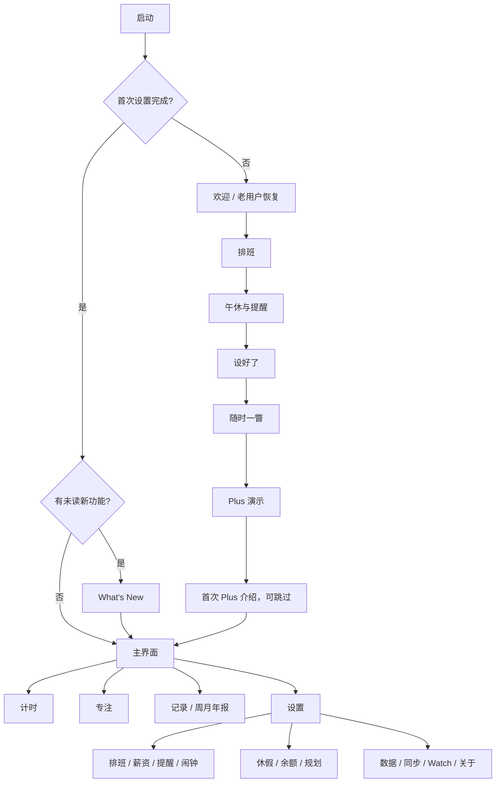

# iOS 3.2.1 发布前复审（对照 Plan 020）

日期：2026-10-04。范围：欢迎页、What's New、主要页面冒烟、HIG 与文案；修复可定位的 UI 细节。
经用户明确要求在模拟器做视觉测试。设备：新建的干净 iPhone 17 模拟器（iOS 27.0），
Debug 3.2.1（2），简体中文为主，抽查英文与德文。

## 测试环境的限制（先读）

- 本机负载异常：load average 在 100–730 之间波动，模拟器启动 20–30 秒，点击注入延迟数秒，
  Xcode 设备交互会话两次在中途断开、模拟器被关闭。以下结论只记录实际看到的画面；没看到的不计为通过。
- 系统弹窗（通知授权、评分）无法通过注入点击关闭；残留的系统弹窗会跨重装出现，重启模拟器后消失，不计为 App 问题。
- 首轮在旧模拟器上看到的“启动后冻结”：采样时主线程空闲在 run loop，干净设备上无法复现，判断为负载与旧设备状态导致，
  不记为 App 缺陷。旧模拟器装好后直接进入英文计时页（未出现欢迎页），来自该设备上已有的 iCloud/本地数据，不是首装路径。
- 文中的截图和录屏只保存在本机临时目录，没有提交。

## 发布阻塞项

| # | 问题 | 处理 |
|---|---|---|
| B1 | App 内 What's New 仍是 3.2.0（节假日、Apple Watch、智能叠放），已升级的用户看不到 3.2.1 的休假规划、班次闹钟和报告 | **已修**：`ReleaseNotes.current` 改为 3.2.1；三项新功能＋“DoneAt Plus”标记；按钮改为与引导页一致的整宽主按钮；19 种语言；移除旧的 7 个键并重新生成 Android 资源 |
| B2 | 仓库内没有 iOS 3.2.1 的 App Store 元数据（`app-store-connect/ios/3.2.1*.json`，商店“新功能”文案与宣传文本） | 未处理，属于发布流程，按 [Releases](../agent-guides/releases.md) 补齐 |
| B3 | Plan 020 状态仍写“尚未指定发布版本” | **已定**：用户确认仍用 3.2.1，Plan 020 已同步 |
| B4 | 10-03 真机验收仍未完成的项（见下文 Plan 020 对照） | 用户确认 iPhone 直接贪睡与 120 Hz 已通过；其余后续继续测 |

## 已修复

### 1. 菜单行在弹出后滑动会“脱离表单”（用户报告）

**现象**：设置 › 工作时间与排班，点“排班规律”唤出玻璃菜单后立刻滑动，菜单退出，但这一行沿自己的轨迹飞回，
不跟随表单滚动。

**根因（模拟器已复现）**：这些行把整行作为 `Menu` 的 label。iOS 弹出菜单时会把 label 从原位置“提起”并入菜单动画，
关闭时再飞回原处。截图中，菜单打开期间“排班规律”整行从卡片里消失；滑动关闭时，这行与正在滚动的内容不同步。

**修复**：新增 `View.owcRowMenu(accessibilityLabel:cornerRadius:items:)`（`OWCComponents.swift`）。行内容画在菜单之外并
忽略点击，菜单的 label 只是一块透明点击区，按压高亮仍由 `OWCRowButtonStyle` 提供。菜单打开时行留在原地，关闭与滚动时
只有系统菜单本身淡出。录屏对比：修复前行在菜单期间消失；修复后全程留在卡片中并随内容滚动。

同类位置一并替换：

- 设置 › 工作时间与排班：排班规律行（`ScheduleCalendarEditor.modePicker`）
- 同页轮班/固定星期的周期格子（`cycleGrid`）
- 设置 › 薪资：每月工作天数（月薪时显示）。同时把向右箭头换成菜单通用的上下箭头，菜单改为带勾选的 Picker
- 引导页：轮班的“今天是第几天”行

小的“…”按钮、系统 `Picker(.menu)`、长按 `contextMenu` 本来就是系统预期行为，未改。

### 2. 引导页第 2 页“继续”掉到屏幕外

iPhone 17 默认字号下，排班页比屏幕高约 80 pt，“继续”只露出半个。其他页的按钮都在同一位置，
在第 1 页点“继续”的位置连点，第二下落在“节假日安排”行上，打开了地区选择。

**修复**：节假日从“开关＋地区”两行合并为与设置页相同的一行（`节假日安排  建议：中国大陆 >`），
地区选择本身已有“关闭”；并收紧几处纵向间距。修复后整页落在一屏内，按钮位置与其他页一致（已截图核对）。
轮班模式或更大字号时仍可滚动，这是预期。

### 3. Plus 付费墙没有提到报告

报告是 3.2.1 的主打 Plus 功能，付费墙的权益列表和副标题都没写。**已修**：新增权益“动画回顾的周报、月报和年报”
（排在班次闹钟之后），副标题加入“回顾报告”，19 种语言。

### 4. 启动白屏闪到灰色页面

`LaunchScreen.storyboard` 与 `AppRuntimeLoadingView` 用的是 `systemBackground`（浅色下纯白），之后的所有首屏是
`systemGroupedBackground`，冷启动时会从白色跳到灰色。**已修**：两处都改为 grouped 背景；深色模式两者本来都是黑色，不受影响。
系统会缓存启动图，需删除重装后才能看到变化。

## 产品决定（第二轮已按以下方案修改）

### R1. 系统评分弹窗在冷启动 650 ms 后出现（重要）

`AppReviewPromptModifier` 在“完成过一次班次后的下一次冷启动”调用 `requestReview()`。干净设备上，
进入设置页约一秒就弹出“喜欢 DoneAt 吗？”。Apple 对 `requestReview` 的说明是不要在启动时立即请求，
而应在用户完成一件事、自然停顿时请求。3.2.0 时这里是自定义预询问，10-03 的提交改为直接调用系统接口后，
打扰程度明显上升。提交说明里“已升级用户不会立刻被提示”也不成立：旧流程停在 `readyForNextLaunch` 的用户，
升级后第一次启动就会弹出。

建议：改在用户自己在 App 里看到下班庆祝结束后请求（或关闭报告结束页后），并要求至少完成几个不同日期的班次；
保留现有的每版本一次与 120 天间隔。

**已改**：不再在启动时请求。`AppReviewPromptState` 按记录日历统计完成班次的不同日期，满 3 天才到期；只有用户在场看到
下班庆祝（完成时刻与当前相差不超过 2 分钟）时才提出，庆祝动画结束约 6 秒后请求；期间若有其他界面覆盖或 App 进入后台，
这次机会作废，不会稍后突然弹出。保留每版本一次与 120 天间隔，请求后重新计数。旧版本保存的
`readyForNextLaunch` 仍可解码，但升级后不会因此弹出。

### R2. 引导流程 11 页偏长

欢迎 → 排班 → 午休提醒 → 设好了 → 隐私 → 系统界面 → 横屏 → Plus 记录 → Plus 专注 → Plus 休假闹钟 → 完成。
其中 5 页是功能介绍。编辑推荐通常看重“尽快进入内容”。建议：合并“系统界面”与“横屏”；三个 Plus 页合为一页可左右切换的卡片，
或留给付费墙；目标 7 页以内。另外，3.2.1 的报告在引导页里完全没有出现。

**已改为 6 页＋试用页**：欢迎（隐私作为一项要点）→ 排班 → 午休和提醒 → 设好了（新增“更多设置”，按设置页的名称说明薪资、
班次类型与自由排班、提醒与实时活动在哪里）→ 随时一瞥（系统界面实时演示，横屏全屏只占一行）→ DoneAt Plus（一页舞台，
依次自动播放记录、报告、专注、休假与闹钟四段演示，分段进度条可点按跳转；用户第一次滑动或点按后停止自动播放；
减少动态效果时不自动播放；辅助功能大字号时改为纵向列出）。之后进入 Plus 介绍页。

移除隐私／面容 ID、横屏、三个 Plus 页与结束页。生物识别不再在引导中预先请求，首次查看隐藏收入时由系统按
`NSFaceIDUsageDescription` 询问。

**试用页**：介绍页顶部加 Plus 标记；年订显示折合每月价格；可试用时在购买按钮上方显示三步时间线（今天解锁、第 7 天按年计费、
在此之前取消不扣费），按钮下方直接写明试用后的价格。

### R3. 文案与命名

- “本月 · 已生效”出现在引导“设好了”页和计时页“接下来”里的上班时间下，像系统状态码，用户难以理解。
  建议在引导页去掉，在计时页改为更直白的说明，或只在下月排班尚未生效时提示。
- 隐私页“除非你自己去查看方案或开启 iCloud 同步”：“查看方案”指向不明（实为读取 App Store 购买信息），
  建议“除非你购买或恢复 Plus，或开启 iCloud 同步”。
- “通过灵动岛、小组件、锁定屏幕和 Apple Watch 掌握最后一段时间”：“掌握最后一段时间”生硬。
- 同一概念不同叫法：引导页“先不排班”，设置菜单“手动计时”，另有“自由排班”。建议统一并在两处使用同一组名称。
- “建议：中国大陆”作为行的值读起来像提示语，可考虑“中国大陆（自动）”。
- 记录入口“播放本周的报告 / 播放本月的报告”与“查看年报”动词不一致。

**已改**（19 种语言）：“本月 · 已生效／下月 · 预定”改为“按排班／按下月排班”；隐私页随页面移除；系统界面文案改为
“下班前的最后一段，在灵动岛、小组件、锁定屏幕和 Apple Watch 上一眼就能看到。”；引导中的“先不排班”统一为“手动计时”，
说明改为“不设固定排班，每天自己开始计时。”；报告入口统一为“播放周报／月报／年报”。

节假日：未设置即未开启，设置页原先显示“建议：中国大陆”像是已生效，现在显示“关闭”，地区列表里仍把推荐地区排在最前；
引导页在完成时会应用推荐地区，因此直接显示地区名。`holidayCalendarSystemDefault` 与 Web 共用，措辞未改。

iOS 不再使用、Android 仍在用的 6 个键移入 `android-strings.json`；两端都不用的键已删除。

### R4. 视觉细节

- 引导页内容滚动时会从悬浮的返回按钮下穿过，没有顶部边缘效果，标题与按钮重叠。
- 工作时间与排班页：月历按周日开始，下方“排班规律”的星期按周一开始，同屏两种顺序。
- 休息日计时页的主按钮是橙色整宽“手动计时”，休息日最醒目的操作是开始计时，值得再权衡。

## 冒烟结果（实际看到的）

| 页面 | 结果 |
|---|---|
| 欢迎页（11 页逐页） | 文案、卡片、页码点正常；通知授权在“午休和提醒”页点继续时才请求，有上下文 |
| What's New（中/英/德） | 新版卡片无截断；关闭按钮与内容不重叠 |
| 付费墙（免费） | 修改前的权益列表与副标题显示正常；新增的报告一行未再截图核对。商品卡在本次模拟器上停在加载状态，未判断原因（Debug 启动未使用 StoreKit 配置文件时可能如此），需在 TestFlight 上确认 |
| 设置根页 | 各分组可见，“班次闹钟 关闭”“记录与数据 已关闭”状态正确 |
| 工作时间与排班 | 月历、排班规律菜单、节假日行正常；菜单修复已录屏核对 |
| 健康提醒 | 单开关页正常 |
| 计时页（休息日） | 倒计时、本周/今年估算、接下来正常 |

**未覆盖**（负载下点击不可靠，或需真机/权益）：专注页、记录页各尺度与报告播放、休假规划全流程、班次闹钟页、
Apple Watch 页、数据与同步、深色模式、iPad 与横屏、VoiceOver 与大字号。这些在 Plan 020 R1–R5 和 10-03 真机验收中
有部分记录，但不能当作本轮已复验。

## Plan 020 对照

| Plan 020 项 | 状态 |
|---|---|
| 休假规划 P1–P3c（规划、余额、采用/撤销、日历标记、三次体验） | 已实现，自动化测试见 Plan §9；本轮未在 UI 上重走 |
| 班次闹钟 A1–A3 | 已实现；10-03 真机：Watch 贪睡联动、复响、停止通过；**iPhone 上直接贪睡、通知关闭/到期/响铃中的权益边界、App 未运行时的刷新通知、实际预约容量未验** |
| `stopIntent` 自动补排 | 未实现，以预排刷新通知兜底（Plan 已记录） |
| 动态报告 R1–R5 | 已实现；10-03 真机修复了暂停后翻页空白；**长按暂停、ProMotion 持续帧率与触感未验** |
| 免费加班一行汇总 | 已实现（Plan §5）；本轮未复看 |
| 发布信息 | What's New 已更新（本轮）；商店元数据缺失；发布版本号待定 |
| TestFlight 升级/恢复购买、CloudKit 跨设备、Widgets/实时活动 | 未验（10-03 文档已列） |

## 第二轮验证（2026-10-04 晚）

- iOS 模拟器构建通过；`AppReviewPromptTests`（9）、`ReleaseNotesTests`、`SceneStateTests` 共 31 项，以及
  `onboardingSequenceEndsWithPlus()`、`onboardingSequenceAlwaysConfirms()` 两项顶层测试实际运行并通过
  （顶层测试与 suite 混在一次 `-only-testing` 里会被静默跳过，需单独运行）。
- `check:ios-strings`、`check:ios`、`lint`、`npm test`（539 项）通过；Android 资源已重新生成。
- 模拟器：中文浅色 6 页；德文“设好了”与 Plus 页；深色“设好了”、随时一瞥与 Plus 页。Plus 页自动播放按顺序经过四段，
  修复了两处问题：自动播放从第一段直接跳到最后一段（改为单一循环驱动）；卡片阴影被分页区域裁切成灰色色块（加入阴影留白）。
- 系统外观在引导中途切换不会重置页码。用 `-theme dark` 启动参数时 QA 页码参数会失效，属于 DEBUG 启动参数的问题，
  不影响用户。
- **未核对**：付费墙试用时间线需要 StoreKit 配置运行，Xcode 当前报 CoreSimulator 版本不匹配，需重启 Xcode 后再看；
  Android Gradle 检查按用户安排另开会话。

## 第一轮验证

- `npm run check:ios-strings`、`npm run check:ios`、`npm run lint`、`npm test`（539 项）通过；Android 资源已重新生成。
- iOS 模拟器构建通过；`AppReviewPromptTests`、`ReleaseNotesTests`、`SceneStateTests` 共 31 项实际运行并通过。
- 修复后已在模拟器核对：排班规律菜单（录屏）、引导第 2 页、What's New（中/英/德）、启动背景。
- **Android Gradle 检查未完成**：本机负载下运行约 30 分钟无输出后手动停止。本次 Android 侧只有生成的文案资源变化
  （删除 7 个 Android 代码未引用的键、新增 4 个键、修改 1 个），提交前仍需按 Android 指南跑完整 Gradle 命令。

## Codex 接续：Duo 与欢迎页（2026-10-05，Asia/Shanghai）

接续分支 `claude/project-thread-u5h2q8`，在原有未提交修改之上维护；没有重置 Claude 的工作、提交或推送。
本轮重点是用户新指出的 Duo 展开横屏、欢迎页动画，以及原复审尚未覆盖的可复验项目。

### 本轮修改

- **Duo 展开横屏误进全屏时钟：已修复并实测。** 原条件只有 phone idiom + 窗口宽大于高，展开内屏也满足。
  现在额外要求垂直 size class 为 compact，并监听该 trait 的变化；regular 高度保留原有 TabView 和导航树。
  不用设备型号字符串、固定屏幕尺寸或折叠角度猜测。Duo 展开横屏已看到正常计时页；后续按用户确认改为侧栏双列；
  普通 iPhone 17 横屏仍进入全屏时钟。新增回归测试覆盖 regular/unspecified 高度、竖屏和 iPad。
- **六页欢迎流程的操作区统一。** 前一轮只给部分页接入了 `OnboardingPageScaffold`，午休/提醒和 Plus 页仍将按钮放在正文末尾。
  这两页现已接入同一个滚动正文 + 固定底部容器。Plus 轮播选择器、欢迎页的老用户恢复入口也留在操作区，
  短屏上不再藏在底部边缘效果后面。正文允许滚动；辅助功能字号不裁掉长内容。
- **首屏入场。** 复用现有矢量品牌 mark：指针从 -120° 在 0.9 秒内安静归位到五点，品牌字、品牌句、三条价值按 70 ms 节奏渐现并上移 12 pt。
  首屏动画不触发庆祝触感，不循环，不阻挡继续。原五连击彩蛋仍保留。曲线统一放在 `OWCMotion`。
  减少动态效果时立即呈现完整内容，不转动、不位移。根据正文可用高度收缩 mark 和间距，Duo 短屏也给文案留够位置。
- **Plus 播放生命周期。** 应用不在前台、启用减少动态效果、VoiceOver 或辅助功能字号时停止自动翻页。
  进入后台会取消等待，不会恢复时补跳章节；重新到前台从当前章节重新计时。手动点段或拖动后停止自动翻页。
  自动翻页不产生选择触感；手动选择才产生。分段触摸目标扩大为 44×44 pt；大字号改纵向浏览，说明不限制为六行。
- **引导设备文案。** 硬件演示仍区分 iPhone/iPad，但“横屏时钟/侧边栏”说明按可用宽度切换，不再把展开 Duo 描述成必然横屏全屏。
- **语言目录清理。** 工作区内两条未翻译且未被有效引用的 Xcode 占位项 `%@`、`%@ · %@` 使语言检查及 `npm test` 失败。
  移除这两项后检查恢复通过；后续构建未重新产生它们。没有替换 Claude 的 19 语文案或重写 Android 资源。

### 本轮实际验证

| 范围 | 结果与边界 |
| --- | --- |
| Duo，iOS 27.1，展开横屏 | 修复前复现全屏黑底时钟；修复后正常计时内容、右侧工具栏和四个标签入口可见 |
| Duo 内外屏切换 | 排班页收起、提醒页展开，保留当前页和设置值；未把半折和所有旋转姿态算作通过 |
| 欢迎六页，简中 | 从欢迎逐页点到 Plus 并进入主界面；返回控件、页码和固定继续按钮可见 |
| 欢迎首屏 | 普通 iPhone 17 英文浅色；Duo 德文深色，最终短屏布局三条价值和恢复入口均可见 |
| 欢迎动画 | 用 simctl 内屏录屏逐帧检查指针归位及分层入场；证明动画存在和顺序，不证明真机持续 120 Hz |
| Plus 页 | 简中浅/深色、四段自动播放；辅助功能字号改纵向长页且继续按钮保留；切换减少动态效果的静态画面检查 |
| What's New | iPhone 17 英文：DoneAt 3.2.1，三项 Plus 功能、关闭及继续可见，无截断 |
| 主要入口 | Duo 设置与工作时间/排班页；iPhone 17 专注空状态、班次闹钟关闭状态已看到。未把启动占位画面当作休假页通过 |
| 普通 iPhone 17 横屏 | 全屏倒计时仍可进入，未因 Duo 修复丢失 |
| 工程 | 最终模拟器构建、`check:ios`、`check:ios-strings`、`lint`、`git diff --check` 通过；`npm test` 49 文件、539 项通过 |
| iOS 自动化 | 12 suites、127 项实际运行通过：横屏策略、SceneState、ReleaseNotes、AppReviewPrompt、LeavePlanner/Adoption/Schedule/Records、ShiftAlarmPlanner/Service、CycleReport/Playback；单独运行六页顺序顶层测试 1 项通过 |

自动化证据：XcodeBuildMCP 的 `test_sim_2026-10-04T16-11-08-377Z_pid99961_0a421327.xcresult`
和 `test_sim_2026-10-04T16-27-21-304Z_pid99961_cf6f37ba.xcresult`，在本机
`~/Library/Developer/XcodeBuildMCP/workspaces/doneat-site-a51b87725ee2/result-bundles/`。
日志明确有 `Test run with 127 tests in 12 suites passed`，新增 `expandedPhoneKeepsItsAppEvenWhenWiderThanTall` 也实际运行。
录屏与截图留在临时目录，不提交二进制证据。构建测试中有既有 `ThemeAppearanceTests` 使用弃用 `UIWindow.init()` 的警告，无新增构建错误。

### 路由与设计审视

- 品牌入场服务于“时间归位”的产品含义；可立即继续，避免强制等待。首个设置在第 2 页，核心流程清晰。
- 恢复入口应在首屏直接可见；Plus 演示由用户随时接管；免费系统能力与 Plus 能力保持明确分组。
- Duo 适配保留同一份导航与编辑状态；展开双列、收起系统标签栏、横向半折上下分区。
- “达到 Today/编辑推荐”不能由截图或单轮自动化认证。当前改动改善了进入节奏、连续性和可达性；
  下述真实购买、真实闹钟、无障碍导航和设备帧率仍属于交付质量证据，不能省略。

依据：[Apple Duo HIG](https://developer.apple.com/design/human-interface-guidelines/designing-for-iphone-duo)、
[Preparing your app for iPhone Duo](https://developer.apple.com/documentation/technologyoverviews/preparing-your-app-for-iphone-duo)。

### 仍未通过的发布门槛 / 下一轮

- 商店 3.2.1 元数据仍缺失（仓库只有 3.2.0 对应文件）；真实 StoreKit 试用时间线、升级恢复购买需配置运行或 TestFlight。
- 沿用前文 AlarmKit 容量、权益失效时响铃/贪睡、未运行时刷新通知，以及 CloudKit、Widget/实时活动的真机门槛。
- 解锁后补验了菜单、休假建议详情、年报重播/文字简报滚动和 Duo 展开/半折；完整 VoiceOver、iPad 全量扫描、真机帧率仍未验收。
- 休假建议已滚动检查到加入按钮，未写入测试设备的排班；完整购买及排班采纳链路不能只凭详情截图算通过。
- Android 生成资源来自 Claude 前轮，本轮未改；前轮尚未完成的 Gradle 验收仍需单独完成。

本轮没有提交 App Store、生成发布包、推送或合并；不能据此标记 3.2.1 全量发布前测试已完成。

### 解锁后补验与 Duo 布局追加

- 用户确认：展开采用左侧导航、右侧当前页面，横屏沿用同一布局。`AdaptiveAppShellView` 在 phone 场景使用 SwiftUI Button 侧栏与稳定 TabView；iPad 保留原生 sidebarAdaptable；仅改变侧栏宽度和标签栏可见性，页面路径继续由 SceneState 持有。避免系统在 Duo 竖屏把 NavigationSplitView 侧栏变成覆盖内容的浮层。
- iOS 27.1 的 `GeometryProxy.reservedRegions(kind: .division)` 检测活动横向折叠区域；`FoldedTimerView` 把倒计时与接下来分别放在上下可用区域，扣除系统给出的 margins，各自可滚动。不读取角度或匹配机型。无排班时保留原空状态。普通紧凑高度的手机横屏不启用侧栏。
- Duo 模拟器实测：展开竖屏/横屏双列、侧栏切换设置、进入工作时间与排班后收起保留详情；Book 姿态旋转到横向铰链时，倒计时在上，健康/下班提醒和操作在下。
- `owcRowMenu` 的透明 Menu 从 background 改到 overlay，显式开启命中与辅助功能。原 background 版本在 Duo 上无法点开；修复后可点开，滑动关闭菜单时可见行不被系统单独提起。录屏 `/private/tmp/doneat-duo-menu-fixed.mp4`；未把所有高速手势组合宣称为覆盖。
- 欢迎预告现在用尚未保存的节假日/排班草稿生成完整 preview，休息日推进到下个班次；健康提醒也使用同一草稿。首次设置完成前不写入正式排班。中国大陆 2026-10-05 预告与完成后均落到 10-08，未来班次不再标为“今天的班次”。新增 OnboardingPreviewTests 覆盖节假日、无节假日、重播旧设置和手动计时。
- 休假规划：打开 10-05 至 10-11 建议，确认请假 10-08/09/10 三天、余额 7→4，并滚到加入入口。年报：播放到结束、重播、打开文字简报并滚到底部十二个月，再关闭。
- Plus：手动选段后不再自动跳段，Book/Open 切换保留当前段。
- 最终 `npm test` 再跑 49 文件 / 539 项通过；`check:ios`、`check:ios-strings`、`git diff --check` 通过。新增草稿预告曾引发 fixture 源文件哈希变化，已改为 preview 专用复制方法，未改变 CountdownRules 的定义与规则。

追加原生回归：最终预告/SceneState/横屏策略 3 suites、23 项实际通过，结果 `test_sim_2026-10-04T17-03-15-379Z_pid99961_a5ded5ae.xcresult`。这是重跑覆盖，不与前述 127 项简单相加。

最终 Duo 构建 `build_run_sim_2026-10-04T17-08-43-696Z_pid99961_08e26936.log` 成功；最终展开与半折截图分别在 `/private/tmp/doneat-duo-expanded-final.png`、`/private/tmp/doneat-duo-folded-final.png`。模拟器停在 DEBUG 工作场景的半折计时页，便于查看；样例时钟不代表设备当天真实排班。

## R7 · 欢迎旅程、统一 Plus 页面与 24 小时邀请（2026-10-05）

本节替代 R6 图中“必须走完六页后进入首次付费墙”的路线。前四页是首次设置；第 4 页即可开始使用，后两页是可选探索。首次设置完成不再强制弹出付费墙或重复展示本版更新。

- 欢迎：保留品牌入场与恢复入口，减少长段说明；四步进度只表示设置。返回已访问页面不重播品牌入场。
- 排班与提醒：时间、有效工作段、休息间隔与提醒共用草稿预告；排班规律使用单个原生菜单与逐步展开的设置。完成页展示自己的下一班和接下来，不用固定的演示工时冒充用户设置。
- 免费能力：小组件、锁屏和实时活动由用户切换，沿用已配置班次的示例；Plus 演示可以随时手动接管，减少动态效果、VoiceOver 和辅助功能字号下不自动轮播。
- Plus：购买页用手动切换的报告、休假／闹钟、专注场景解释价值，明确标注示例；方案、试用时间线、恢复和错误处理继续使用原有 StoreKit 逻辑。设置页也复用同一独立滚动页面，避免两个纵向 ScrollView 嵌套。
- 更新：What's New 展示 Plan 020 的休假、班次闹钟、周月年报，符合资格的老用户能在页内领取优惠；“继续使用”始终可见。
- 优惠：用户明确选择领取后 24 小时，而非第一次看到就开始。持久化一次领取时间，重开不续期；已验证 Plus 用户不显示优惠；离线／商品不可用时不消耗领取机会，不替换为原价支付。恢复购买接受两种已验证终身商品。到期时父页面同步恢复普通方案。邀请横幅可关闭，设置入口仍可访问。
- 这是本机邀请期限，不是服务端账户优惠券；卸载重装或设备时间篡改没有服务端防重能力，不宣称按 Apple ID 严格一次。

### App Store Connect 配置

用户授权后创建独立非消耗型商品 `com.rainif.offworkcountdown.plus.lifetime.offer`（ASC ID `6819062722`），未提交审核、未修改原商品价格。Family Sharing 与普通终身一致，17 个商店本地化及 175 个可售地区与原终身商品对齐。美国为价格基准，其余地区由 Apple 均衡定价，中国单独覆盖。

| 地区 | 普通终身 | 本次优惠 |
| --- | --- | --- |
| 中国大陆 | CNY 58 | CNY 43 |
| 美国 | USD 24.99 | USD 18.99 |

价格均经 API 回读。因 Apple 价格档位并非恰好 75%，界面展示实际商品价格，不写精确折扣百分比。旧版没有请求新增 SKU；但商品审核和 App 版本审核是不同状态，不能笼统保证任何 IAP 都会自动跟随指定版本发布。此次未发起审核。

### 验证与未通过项

- 最新模型回归：4 suites / 14 tests 通过，覆盖领取与精确到期、不重置、设备时间回退、同币种真实降价、已购屏蔽、草稿节假日／跨夜／结束后推进及 Duo 横屏策略。结果 `test_sim_2026-10-04T18-20-00-199Z_pid99961_0936ed65.xcresult`。
- Android：domain/data/designsystem/app 单测、lintDebug、assembleDebug、assembleRelease 通过，188 tasks（45 executed），日志 `/private/tmp/doneat-redesign-gradle.log`。移除的三个 iOS 旧文案仍被 Android 页面使用，已移到 Android 自有目录再生成，未删掉 Android 所需文案。
- StoreKit 集成测试三次停在 SKTestSession 初始化，未进入购买断言；保留为显式启用的测试 `DONEAT_STOREKIT_INTEGRATION=1`，不把默认不运行称为通过。随后通过 Xcode 手动运行验证：系统无扣费测试确认框显示 US$18.99，交易成功后 App 显示永久 Plus。交易管理器核对 Product ID 为 `com.rainif.offworkcountdown.plus.lifetime.offer`、United States、US$18.99、Purchased。随后在 Xcode 交易管理器模拟退款，状态变为 Refunded，App 撤销永久权益并回到可购买页面。自动化 SKTestSession 超时仍单独保留；恢复购买链路尚未完整验证。
- 模拟器验证了中文个人预告、可选 Plus 手动展示、What's New 到优惠的跳转及领取后倒计时。中国价格预览 ¥58→¥43 已查看；DEBUG 预览在没有真实商品时禁用购买，并明确显示预览说明。
- 本节不替代 R6 遗留的真实 AlarmKit、CloudKit、完整 VoiceOver、iPad 和真机动态表现门槛。

最终 JS 回归在两个 worker 下 49 文件 / 539 项通过；lint、check:ios、check:ios-strings、check:android-strings、asc:iap:check、git diff --check 通过。此前同时运行 Gradle 与 Xcode 时出现测试调度超时，串开后通过，未提高测试超时阈值。Xcode 自动提取的组合字符串通过显式 `Text(verbatim:)` 修正，仍由 AppText 提供本地化片段。

ASC 最终回读：审核截图（标准 iPhone 17、1206×2622）处理为 COMPLETE，新商品为 READY_TO_SUBMIT；截图保存在 `app-store-connect/iap/review-lifetime-offer.png`。Duo 内屏 2007×2853 被 ASC 拒收，仅作为布局验证证据。未提交审核。普通 iPhone 另验证了设置内 Plus 返回后出现邀请、领取前不计时、领取后显示 US$18.99 与剩余时间；补齐 PlusSettingsView 返回时发放邀请的入口。最新 Xcode 构建并运行成功，构建后文案检查和 diff 检查通过。

### 设计验收前收尾

- iPhone 17 英文、浅色、标准字号：实际走完四步设置和两页可选探索，免费系统能力手动切换、Plus 场景切换和开始使用均可达，完成后直接进入计时页。欢迎与六页流程录屏：`/private/tmp/doneat-321-welcome-en.mp4`。
- 德文、深色、Text Size 10、减少动态效果：修复恢复／探索按钮占满固定页脚、接下来行挤压时间、Plus 装饰日历横向撑宽、场景固定高度裁切等问题。辅助功能字号下次要操作进入滚动正文，预告时间与详情纵排，场景按内容高度展开；实际滚动查看了最后的休假／闹钟示例与操作入口。
- 同一大字号环境复查购买页和更新页：购买入口可直达优惠卡，价格纵排后 US$18.99 与原价保持完整；剩余时间改为纵排。更新页优惠入口在辅助功能字号下省去装饰图标，保留完整文字及固定继续按钮。
- 阿拉伯语深色、标准字号：排班页阅读方向、返回位置、星期排列和时间内容目测通过。这是代表性检查，不代替 19 语完整设备矩阵或 VoiceOver 操作验收。
- 最终 iPhone 17 构建 `build_run_sim_2026-10-04T19-08-31-384Z_pid99961_89a6d6ca.log`、Duo 构建 `build_run_sim_2026-10-04T19-09-40-170Z_pid99961_ba86d42d.log` 成功；iOS 结构、文案与 diff 检查通过。两台模拟器已恢复中文、浅色、标准字号、正常动画，停在新版欢迎首屏供用户验收。

欢迎／购买／更新页本轮设计实现已可交付用户验收；恢复购买、TestFlight 交易及前文真实系统能力门槛仍未完成，不等于 3.2.1 已满足发布条件。

## R8 · 补齐品牌首屏与跨页连续性（2026-10-05）

用户指出 R7 的“设计完成”判断过早。本轮仅补齐之前明确欠缺的两项，不以构建通过替代设计验收。

- 首屏删除三行功能清单，保留品牌 mark、品牌名、突出的品牌句及一条离线／无账号承诺。指针归位后分层呈现；返回不重播，减少动态效果下静态呈现。
- 成果与系统场景使用真实当前时刻、同一份草稿规则投影。移除第 5 页“下班前 15 分钟”的时间替换，节假日时延续同一个下一班倒计时；锁屏场景也明确显示上班前／休息中的状态。
- 两页间的数字由父视图持续绘制，在页面提供的位置之间移动并调整字号，周围内容淡入淡出。录屏逐帧发现的双份数字重影已通过单一显示层消除。滚动视口提供裁切边界；辅助功能阅读保留在页面原位置，显示层不重复朗读、不接收触摸。开启减少动态效果时以切换当下为固定参考，不回跳到进入页面时刻。
- iPhone 17 中文浅色的前四步与系统场景往返已实走并录屏，连续性片段 `/private/tmp/doneat-continuity-review.mp4`；品牌入场片段 `/private/tmp/doneat-welcome-brand-review.mp4`。英文深色标准字号及 Text Size 10 首屏、成果页首段已目测；Duo 封面屏首屏已目测。
- **本轮未验证通过**：最大字号的滚动裁切（模拟器拖动／滚动输入没有得到可靠画面变化）；Duo 展开复验（控制操作出现黑屏后仍回到 Closed，未取得稳定展开结果）。R6 的既有展开证据不能替代本轮新连续过渡的展开验证。
- 最新 iPhone 构建 `build_run_sim_2026-10-04T22-38-17-935Z_pid7017_3c065c05.log`、Duo 构建 `build_run_sim_2026-10-04T22-40-48-565Z_pid7017_05e98801.log` 成功。`check:ios`、`check:ios-strings`、`git diff --check` 通过；仅 UI 变化，无业务规则／商品配置变更，没有把上一轮测试数当作本轮重跑。

两项设计实现已落地，最终用户视觉验收和上述两项补验仍待完成。模拟器保留新版欢迎页，未提交、推送或发布。

## R9 · 系统场景辨识与 Duo 宽屏（2026-10-05）

- 新增 `OnboardingSystemScene`：桌面状态栏与图标轮廓、小组件卡片；锁屏日期／时钟与单色矩形配件；黑色扩展灵动岛与摄像头留白。结构对照现有 Widget／Activity 扩展，明确标注“班次预览”；这是 App 内场景演示，不是实际运行的系统小组件，也不是像素级截图。
- 三场景继续使用自己的草稿班次。上班前的实时活动显示下一班日期与开始时间，不用运行中的倒计时冒充已经启动的活动。锁屏时钟按当前语言显示，省去 AM/PM 以适应系统预览尺寸。
- iPhone 按可用高度收紧场景；Duo 宽度至少 650 pt 时左侧文案／选择器、右侧场景，消除选择器被固定页脚挡住的问题。辅助功能字号保留单列滚动，次要入口在正文内，主操作固定；只有系统预览按展示尺寸排版，外围文案与操作仍响应 Dynamic Type。

### 本轮证据与范围

- 英文深色标准字号走完六页，三个免费场景、Plus 与“开始使用”可达，最后直接进入计时页。录屏 `/private/tmp/doneat-onboarding-r9-en-dark.mp4`。此录屏早于最后的 Duo 双列及未来班次日期文字微调，不作为最终源代码的完整回归。
- 最终 Duo 展开浅色：左右布局、三个选项与固定操作完整可见，截图 `/private/tmp/doneat-r9-duo-expanded.png`。Text Size 10／减少动态效果下滚动看到三个选项与 Plus，时钟暂停，截图 `/private/tmp/doneat-r9-duo-ax-scrolled.png`。
- **未关闭异常**：切换字号、减少动态效果并返回时，Duo 曾出现旧场景与大号成果时钟混在一起；保留只读采样 `/private/tmp/doneat-r9-duo-sample.txt`。重启模拟器后，展开场景选择及最大字号／减少动态效果下返回均正常，未再次重现；没有确定根因，不宣称代码修复。最后 iPhone 坐标点击多次无可靠页面变化，重启／前后台切换仍未恢复 App AX 控件，最终转场录屏未完成。`doneat-onboarding-r9-final.mp4` 仅记录这一失败尝试，不作为交互通过证据。
- 最终 iPhone 中文浅色第 5 页布局已通过 DEBUG 定位目测，截图 `/private/tmp/doneat-r9-iphone-widget-final.png`。最终构建日志：iPhone `build_run_sim_2026-10-05T01-39-13-545Z_pid7017_c7e13720.log`；Duo `build_run_sim_2026-10-05T01-23-25-774Z_pid7017_0c281bea.log`。`check:ios`、`check:ios-strings`、`git diff --check` 通过。本轮无业务规则或商品修改，不重复计入先前单元测试数量。

本轮明显改善系统场景辨识和展开屏利用率，但不据此宣告达到编辑推荐水准或具备发布条件。最终动态验收、上述异常关闭及 R7 留下的真实系统能力／恢复购买门槛仍保留。未提交、推送或发布。

## R10 · 用户逐项复核与内容双列（2026-10-05）

本节取代 R6 的 Duo 侧栏约定与 R7 的欢迎结束直接进入计时页约定，依据用户最新要求恢复欢迎结束后的 Plus 购买引导。

- 午休保持主动选择：进入提醒页不再默认打开午休及午休提醒；排班页时间线连续，提醒／成果页仅显示实际启用的休息段。成果页突出下一班日期、上下班时间及时间线，把长达数十小时的倒计时降为辅助信息。
- 新用户完成欢迎 → 常规 paywall → 关闭／先不用 → 首次揭晓终身优惠；再次跳过回到计时。未订阅且没有终身权益的老用户在 What's New 最后内容区看到浮动礼物，打开才揭晓价格并开始 24 小时。商品不可用不制造倒计时；已购用户不获得邀请。
- 计时页左上角保留礼物、实际截止时间倒计时与近似折扣，移除底部横幅及其关闭状态。切 Tab、重新打开优惠、重启均不延长截止时间。中国 ¥43/¥58、美国 US$18.99/US$24.99 显示约 7.5 折／≈25% off；其他地区依据商店商品实际价格计算，不伪造精确 25% 降价。
- 礼物改为品牌橙主体，顶部小范围 HDR 高光；浮动在 Reduce Motion、VoiceOver 与非活跃状态停止。模拟器不足以验收真机 HDR 亮度。
- Duo 使用原生 Tab 导航与内容双列：计时／接下来、今天／常用、日历／总结、设置分组；保留手动计时提示、工时与收入信息。横向半折保持上倒计时、下接下来，使用系统 reservedRegions 避让折痕。辅助功能大字号回到单列。
- 系统场景里的实时活动改为与 WidgetExtension 的锁屏活动卡片一致的图标、标题、44 pt 数字、进度与辅助信息层级；未上班时显示实际下一班开始时间。
- 用户补充指出更新页演示卡片下大片留白：PlusFeatureStage 移除固定 230 pt 高度，按内容排版；初始场景直接初始化，不在出现时先呈现另一场景再替换。

### 实际发现的主线程阻塞

普通 iPhone 上动画停在初始透明态、页面不响应输入。采样 `/private/tmp/doneat-r10-iphone-hang.txt` 显示主线程在 `ShiftAlarmService.setRefreshReminder` → `UNUserNotificationCenter.removePendingNotificationRequests` 等待同步 XPC 回复。通知中心的清理操作改成后台任务并 await 完成，仍保留各频道串行顺序，防止旧清理晚到误删替代通知；专注取消也加入同一队列。新增清理挂起期间停止专注的回归，阻止旧请求恢复后弹权限或增加提醒。此证据解释了本次静止画面，不能据此断言 R9 所有异常均有同一原因。

### 本轮验收记录

- Duo 实际点按走通排班 → 午休（默认关闭）→ 成果 → paywall → 关闭 → 优惠 → 先不用 → 计时左上角倒计时；再切换全部 Tab 返回，截止时间仍为同一时间。
- Duo 专注与设置双列截图：`/private/tmp/doneat-r10-duo-focus.png`、`/private/tmp/doneat-r10-duo-settings.png`；半折上下分区：`/private/tmp/doneat-r10-duo-fold.png`。这些是 R10 初轮布局证据，最终颜色与统计微调以随后截图为准。
- 16 项优惠状态、草稿预告、午休默认与 Duo 策略测试通过；JS 49 文件 / 539 项通过。
- Android 四模块单测、lintDebug、assembleDebug、assembleRelease 通过（188 tasks，62 executed）；日志 `/private/tmp/doneat-r10-android.log`。
- iOS 结构、19 语文案、Android 生成一致性、ESLint、diff 检查通过。通知修复后 59 项相关原生回归通过，0 失败、0 跳过；日志 `~/Library/Developer/XcodeBuildMCP/workspaces/doneat-site-a51b87725ee2/logs/test_sim_2026-10-05T03-35-01-924Z_pid7017_d4e62018.log`。
- 最终普通 iPhone 更新页 `/private/tmp/doneat-r10-whatsnew-final.png`：休假日期入场完成、班次闹钟卡片正常显示，说明紧随卡片，无原截图中的大片空白。修复后采样 `/private/tmp/doneat-r10-iphone-after.txt` 未再出现通知清理阻塞主线程。
- 最终 Duo 计时与记录双列：`/private/tmp/doneat-r10-duo-timer-final.png`、`/private/tmp/doneat-r10-duo-records-final.png`；免费用户的记录右列显示既有汇总解锁提示。欢迎成果与实时活动：`/private/tmp/doneat-r10-ready-final.png`、`/private/tmp/doneat-r10-liveactivity-final.png`。礼物颜色与优惠面板：`/private/tmp/doneat-r10-offer-final.png`。
- 老用户 What's New 礼物 → 优惠 → 跳过 → 继续使用的入口实际走通；本次使用已有优惠的模拟器，首次老用户领取时间由状态测试覆盖，未把它计为全新老用户端到端验收。
- 未提交、推送、发布或提交商店审核；真实交易恢复、AlarmKit、CloudKit、完整辅助功能矩阵仍按先前发布门槛跟进。

## R11 · 更新页末尾继续与全图 HDR（2026-10-05）

- 用户进一步要求先经过完整更新内容及礼物入口，再继续。将按钮从固定底栏移到 ScrollView 内容末尾；移除顶部关闭与 accessibility escape 直退，并禁用交互式关闭。无需计时或声称可判断用户是否实际读完。
- 统一礼物图标改为完整 HDR 橙色填充（扩展线性 RGB 2 / 0.6 / 0.04、headroom 2、动态范围 high），不再使用 HDR 顶部与 SDR 主体的混合渐变。沿用浮动、非活跃暂停及辅助功能降动态行为。真机亮度仍需设备验收。
- 验证：iOS 构建成功（`build_run_sim_2026-10-05T04-06-17-787Z_pid7017_0ec54b56.log`），`check:ios`、`check:ios-strings` 与 diff 检查通过。普通 iPhone 实际从首屏滑至末尾，看到完整礼物后点击“继续使用”返回计时；截图 `/private/tmp/doneat-r11-whatsnew-top.png`、`/private/tmp/doneat-r11-whatsnew-bottom.png`。截图仅证明布局及 SDR 映射，不作为 HDR 峰值亮度证据。
- 用户连接真机后，iPhone 17 Pro / iOS 27.0.1 开发签名构建、覆盖安装与启动成功（日志 `/private/tmp/doneat-r11-device-build.log`）。真机实际滚动更新页确认末尾按钮；常规启动未显示优惠入口，不能记作线上商品验证通过。使用既有 `qaLifetimeOffer` DEBUG 启动预览显示同一礼物组件，停留在礼物区域供用户直接目测，未进行购买。镜像已确认布局；物理屏幕 HDR 亮度等待用户反馈。

## R12 · 分层矢量礼盒（2026-10-05）

- 用户反馈 R11 确实明亮但不好看，并确认采用橙色礼盒与香槟缎带方案。替换单色 SF Symbol 为可缩放的 SwiftUI 盒身、盒盖、缎带及贝塞尔蝴蝶结；全部表面保留扩展 HDR 色值，盒身降低亮度，缎带保持更亮的层次。
- 取消持续旋转；约十秒一轮小幅悬浮与间歇抬盖。所有入口共用组件，动态效果关闭、VoiceOver 或后台保持静止。
- `check:ios`、`check:ios-strings`、diff 检查通过；模拟器编译通过（`build_sim_2026-10-05T04-52-36-290Z_pid7017_72f2a84b.log`），真机编译通过（`/private/tmp/doneat-r12-device-build.log`），已安装并启动到 iPhone 17 Pro 更新页礼物区域。真机镜像看到分层橙盒与缎带，无裁切；HDR 物理观感由用户继续确认。模拟器当时已关闭，未将失败的安装／启动记作视觉通过；本轮视觉检查使用真机。

## R13 · 午休展开与付费页入口收敛（2026-10-05）

- 简中／繁中优惠文案改为 `≈{{discount}}折`，保留按商品价格计算的数字格式；移除不再使用的 `plusSkip` 及 Android 生成项。
- 午休页固定顶部间距，避免卡片高度变化使整页重新居中；详情、提示、后续卡片与时间线统一采用 0.3 秒无回弹过渡。动画绑定已提交的偏好值，兼容排队写入；关闭时取消时长输入焦点及时间选择弹层。减少动态效果时不播放该布局动画。
- 常规 paywall 与终身优惠页移除重复的“先不用”，保留顶部关闭。保留功能受限场景的“继续只读”按钮，其语义与退出不同。
- 模拟器实际走通午休开／关、完成欢迎 → paywall → 关闭 → 优惠 → 关闭 → 计时；页面与无障碍树确认不再存在重复跳过按钮，优惠显示 `≈7.5折`。午休前后标题、时间轴、开关位置一致，截图 `/private/tmp/doneat-r13-lunch-off.png`、`/private/tmp/doneat-r13-lunch-on.png`；优惠页 `/private/tmp/doneat-r13-offer-close.png`。此次未进行帧率测量或真实购买。
- iOS 模拟器构建运行通过（`build_run_sim_2026-10-05T05-03-12-284Z_pid7017_b846ae01.log`），真机构建通过（`/private/tmp/doneat-r13-device-build.log`），覆盖安装并启动到已连接的 iPhone 17 Pro。真机仍使用既有 DEBUG 优惠预览参数供目测，不作为线上商品获取成功证据。
- `check:ios`、`check:ios-strings`、`check:android-strings` 与 diff 检查通过；Android 最终四模块单测（548 项，0 失败／错误／跳过）、lintDebug、assembleDebug、assembleRelease 全部通过，日志 `/private/tmp/doneat-r13-android-final.log`。先前未覆盖最终资源的运行已停止，不计入通过证据。

## R14 · iPhone 17 Pro 真机回归（2026-10-05）

用户接受 R13 的欢迎／付费页细节后，授权使用连接的 iPhone 17 Pro（iOS 27.0.1）测试。保留原排班、记录、日文 App 语言和中国区商店；普通启动验证与 DEBUG 场景分开记录。

### 真机通过及覆盖范围

- **真实商品与恢复购买**：移除优惠预览启动参数后获取到 ¥43 / ¥58 商品。恢复购买触发 Apple 账户验证，由用户在设备完成；随后显示永久 Plus，计时页优惠入口消失，班次闹钟等付费功能解锁。没有发起新购买，未将此记作购买／退款／订阅续期验证。
- **AlarmKit**：暂时开启班次闹钟后显示未来一年覆盖及下一批班次。使用现有 DEBUG 一分钟测试闹钟，退到主屏幕后系统响铃界面出现；点贪睡后约九分钟复响，点停止后退出响铃。这里只确认系统界面与交互，不声称测量音量，也没有读取系统实际闹钟总数。结束后恢复闹钟关闭，待响列表移除。
- **ActivityKit**：通过已有 DEBUG 按钮请求真实 15 分钟活动，不修改保存的排班。后台灵动岛数字持续走动，通知中心的锁屏样式卡片显示数字、标题和进度；该处仍出现系统“允许实时活动”选择，未替用户更改这个许可。正常重新启动恢复休息日状态后测试活动从灵动岛移除。尚未覆盖锁定设备／息屏显示、权限拒绝及实际班次自动结束的完整生命周期。
- **功能冒烟**：计时、专注今天／常用、记录月历及空记录报告入口、休假余额编辑器（取消未保存）、设置与 iCloud 已同步状态可访问。保留用户既有模板；未注入记录，未把空态检查计为完整报告播放或休假方案采纳测试。iCloud 状态显示不能替代跨设备同步／冲突验证。

### 本轮发现并修复

1. **折扣语义受系统地区干扰**：日文界面、中国区商品曾显示“約7.5%オフ”。折扣数值与措辞统一由 AppText 的 App 语言决定，中文用折数，日英用百分比；商品货币仍来自 StoreKit。增加中／繁中／英／日回归。
2. **最大辅助功能字号截断**：共用行／导航行的标题与说明取消辅助功能字号下的固定行数；休息／午休状态标签由固定 26 pt 改为内容高度，休息日摘要允许换行。真机最大字号下重新查看专注模板和休息日标题，已完整展开可滚动；未将此记作全 App VoiceOver 审核通过。
3. **未来班次误称今天**：小组件预生成的未来上下班条目不再写“今天的班次”，保留加班语义。增加未来条目回归；覆盖安装后主屏幕小组件周四／周五／周六条目已无错误的“今日”副标题。

### 验证与清理

- 优惠／AppText 11 项、未来 Widget 条目 1 项回归通过，0 失败／跳过。日志分别为 XcodeBuildMCP `test_sim_2026-10-05T05-37-54-861Z_pid7017_f614ba18.log` 与 `test_sim_2026-10-05T05-53-03-197Z_pid7017_11f89190.log`。
- 最终模拟器构建通过：`build_sim_2026-10-05T05-58-46-570Z_pid7017_c9b72f31.log`。最终真机构建通过：`/private/tmp/doneat-r14-device-final-build.log`；已覆盖安装并普通启动。沙盒内一次设备发现失败不计入通过，使用获准的设备服务访问后重新构建成功。
- `check:ios`、`check:ios-strings`、`git diff --check` 通过。本轮未修改共享 catalog，不重复 R13 已完成的 Android 门禁。
- 临时主题恢复浅色，系统字号恢复 3，Reduce Motion 恢复关闭，收入显示恢复可见（经设备 Face ID），专注返回今天；保留真实恢复的永久权益。测试未写新记录、重置配置、提交代码或上传发布。
- **发布尚未全量放行**：仍需独立沙盒账号的新购买／退款／订阅状态变化、AlarmKit 容量和失权边界、CloudKit 跨设备／备份恢复、报告实际数据及完整辅助功能矩阵；之后以 TestFlight 构建验证旧版覆盖升级及正式签名行为。此次开发包真机通过不替代这些门槛。

## R15 · iPad mini 真机布局与导航回归（2026-10-05）

设备为 iPad mini（第 6 代），iPadOS 27.0（24A5430a）。将 R14 当前工作树构建并覆盖安装到用户设备，`/private/tmp/doneat-r15-ipad-build.log` 显示 BUILD SUCCEEDED；通过 Device Hub 操作真实设备。未修改产品代码，未创建交易或注入测试记录。

- **欢迎流程**：横屏走完欢迎、排班、午休提醒、成果页和可选系统／Plus 演示。午休关闭后时间线连续，重新开启保留原来的时间与时长；系统演示包含完整实时活动卡片。竖屏普通重启后的欢迎首页也完整可读。本轮没有逐页完成竖屏欢迎复测，未测量动画帧率。
- **权益**：设备已识别真实永久 Plus，欢迎完成后直接进入计时页；Plus 页面显示已永久拥有。更新页不显示优惠礼物符合资格规则，不能据此计作未购买用户的优惠路径／HDR 验收。
- **主界面**：横竖屏检查计时、专注今天／常用、设置、排班日历及记录月历。记录月历与统计双列可读，人生视图也可访问。横屏侧栏展开后计时、专注和记录仍正常；竖屏侧栏作为覆盖导航打开。收起侧栏未误进全屏倒计时。
- **交互**：排班规律菜单打开后在外部滑动，菜单关闭、表单滚动，未观察到该行脱离卡片的最终状态；远程截图不构成逐帧运动轨迹或性能证明。未保存排班编辑。月报无记录时显示空态并禁用播放，未计为实际数据报告播放通过。
- **What’s New**：临时启动参数覆盖已有的 `debugAlwaysOnboarding` 开关及已读版本，检查横竖屏布局。竖屏能容纳全部内容，横屏须上滑到末尾才能看到继续按钮；三个功能说明均位于按钮之前。演示卡片间距正常，没有旧版卡片下的大段空白。继续按钮成功返回计时页。
- **收尾**：普通重启移除了临时启动参数，保留设备原有“每次启动重播欢迎页”的调试设置，停在竖屏欢迎首页。主题仍浅色、语言跟随系统；午休开关已恢复开启，未新增记录、修改薪资或执行购买。用户为测试关闭的方向锁定保持其选择。

**覆盖边界**：窗口角拖动未实际改变窗口尺寸，窄窗口不能记为通过；本轮未覆盖 iPad 深色／最大字号／VoiceOver／减少动态效果矩阵、锁屏系统能力、独立沙盒交易与有数据报告。欢迎草稿与进入主界面后显示的云端排班不同，观察到已同步状态，但没有做受控双端写入、冲突和离线恢复，因此仍保留 CloudKit 验收项。现有 R14 发布门槛不因本轮布局冒烟而勾完。

## R16 · PR 集成检查（2026-10-05）

提交前合并 `origin/main`（73088d1d）。更新页保留 R11–R15 已验收的完整页面与末尾继续按钮；按 key 合并 catalog，保留主干新增的 en-GB / es-MX，用仓库现有区域文案规则同步本轮新文案，再重新生成 Android 资源。IAP 审核说明已校正为实际的欢迎 → paywall → 关闭后优惠路径。

- 合并后 Vitest：50 个文件、547 项通过；日志 `/private/tmp/doneat-pr-unit.log`。
- 合并后 iOS 模拟器构建通过：XcodeBuildMCP `build_sim_2026-10-05T09-08-07-092Z_pid7017_27e91789.log`。
- Android 四模块单测共 555 项，0 失败／错误／跳过；lintDebug、assembleDebug、assembleRelease 通过，日志 `/private/tmp/doneat-pr-android.log`。使用迁至 `/Volumes/BACKUP/Applications/Android Studio.app` 的 JBR；旧路径启动失败不计为验证结果。
- `check:ios`、`check:ios-strings`、`check:android-strings`、`check:version`、`asc:iap:check`、改动脚本 ESLint 与 diff 检查通过。
- 本轮仅做 PR 集成，不重复真机测试，也未上传或发布 App。R14／R15 尚未完成的发布验收继续保留。本机 Xcode 排序／注释变化与 IDE 配置未纳入 PR，临时保存的本机改动已还原。

## R17 · 旧 SDK 编译兼容（2026-10-05）

PR #299 的 Xcode Cloud iOS 检查暴露出 `GeometryProxy.reservedRegions` 不存在及后续 `TimelineView` 泛型推断失败；R16 的本机工具链为 Xcode 27.1，未覆盖旧 SDK。`#available(iOS 27.1, *)` 只处理运行时可用性，不能使旧 SDK 识别该声明。

- 折痕查询集中到 `AdaptiveDisplayLayout.horizontalFoldEdges`，外层以本机 iOS 27.1 SDK 已验证的 SwiftUICore 模块版本做编译期保护，内部继续保留运行时检查；旧 SDK 返回无折痕信息。
- 内容双列与折痕 API 解耦，窗口宽度驱动的双列不再要求 iOS 27.1 API。自动半折检测仍要求最终归档使用包含新 API 的 SDK，旧 SDK 编译通过不代表该功能已启用。
- iOS 27.1 API 分支编译探针和完整模拟器构建通过（`build_sim_2026-10-05T09-56-39-366Z_pid7017_5b271864.log`）；以 `DONEAT_DISABLE_RESERVED_REGIONS` 排除新 API 后完整回退构建也通过（`build_sim_2026-10-05T09-57-21-695Z_pid7017_1d8a1bc0.log`）。这证明两条代码路径在本机均能编译，不替代旧 SDK 的 Cloud 复验。
- `check:ios`、`check:ios-strings` 与 diff 检查通过。未修改 catalog 或 Android 资源，不重复 R16 的 Android 构建。
- 强制回退路径运行 `PhoneLandscapePresentationTests`：4 项通过、0 失败／跳过，覆盖展开横屏不误进全屏、方向判定与呈现互斥；日志 `test_sim_2026-10-05T09-59-24-193Z_pid7017_bce2302d.log`。
