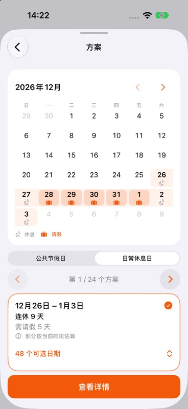
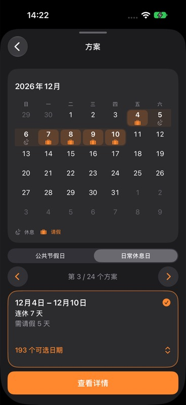
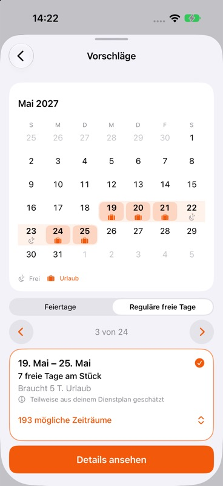

# 3.2.1 请假方案分组与布局验收

2026-10-06，用户明确授权模拟器 UI 验收。设备：iPhone 18 Pro，iOS 27.0。

## 行为

- 公共节假日与日常休息日分开。公共节假日以实际休息的 holiday 标记为准。
- 同成本、同连休长度、同提前出发／延后返工半天数的日常方案归组，所有日期保持可选。日期列表按月排列，打开时定位所选日期，详情仍使用原始方案。
- 单卡片原位切换替代长横向懒加载列表；边框留在卡片上，估算提示预留高度，月历标题统一最小高度。短屏／大字可整体纵向滚动。

## 实际操作

- 公共节假日 → 日常休息日 → 打开 48 个日期 → 选 10.24–11.1，月历更新；列表包含 11.7–11.15。
- 深色模式在原始索引 100（第 101 项）打开 193 个日期，从列表选择索引 106（第 107 项），月历、卡片与详情入口保持对齐。
- 德语浅色检查索引 200（第 201 项）及估算提示，长文案可读，完整边框与详情按钮可见。
- 复现用户截图的 12.26–1.3，显示估算提示；普通方案组从 1 横滑到 8，再从 8 横滑回 1，共 14 次，所选跨年日期保留，边框无偏移／裁切。
- Device Hub 字号从 3 调至 6、开启 Reduce Motion，页面可纵向滑动到完整卡片和详情按钮；打开详情仍为 12.26–1.3，所需请假从 12.28 起。验收后恢复字号 3、Reduce Motion 关闭。
- 未采用样例方案，未写入用户排班或假期余额。未进行真机／iPad 验收。

## 截图

| 跨年估算提示 | 193 个日期归一组（深色） | 第 201 项、德语长文案 |
| --- | --- | --- |
|  |  |  |

## 自动化

- `npm run check:ios`、`npm run check:ios-strings` 通过；Watch／Android 语言产物已重新生成。
- `npm test -- --maxWorkers=2`：50 文件、547 项通过。
- Xcode 模拟器构建通过；`LeavePlanGroupTests`、`LeavePlanCalendarTests`、`LeavePlannerTests`、`LeavePlannerTrialTests` 共 24 项通过，日志确认实际执行（7.793 秒）。
- Android `:core:domain:test :core:data:test :core:designsystem:testDebugUnitTest :app:testDebugUnitTest :app:lintDebug :app:assembleDebug :app:assembleRelease` 通过。

## 只读 QA 入口

DEBUG 启动参数 `-ios.native.qaRoute leave -ios.native.qaLeavePlanner YES`：真实引擎计算 2026-09-21 起一年的周一至周五班次，包含中国节假日与次年未收录提示，最多请 5 天。不会保存样例余额或排班。

加 `-ios.native.qaLeaveProposal 100`、`200` 或 `28` 可直接预览对应原始索引；类别和组内日期一起定位。此入口及样例代码不进入 Release。
